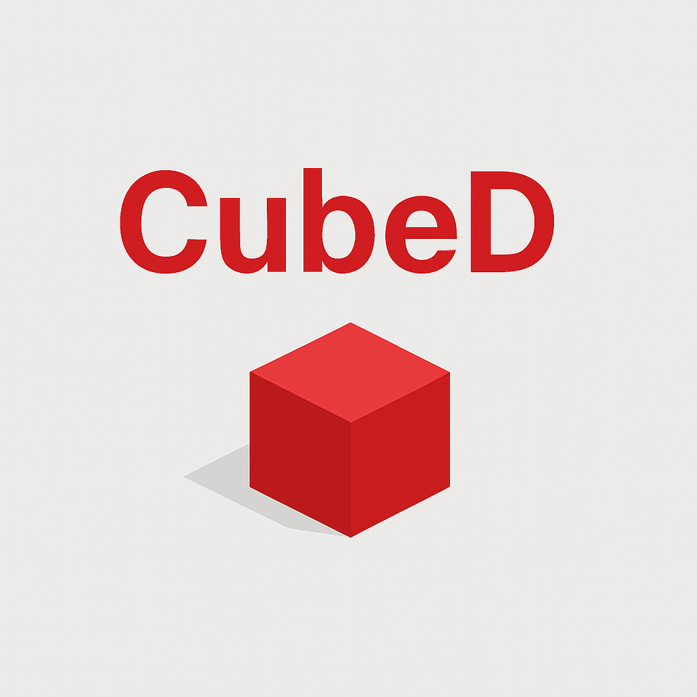

<!-- Banner image (optional, but looks great for marketing) -->

  

# Cube D

  <i>Race. Dodge. Unlock. Conquer every level!</i>

---

**Cube D** is a fast-paced, addictive 3D game where you guide a cube through dynamic obstacle courses. Test your reflexes, unlock new levels, and customize your style as you push your skills to the limit.

---

## 🚀 Features

- **5 handcrafted levels** — Each one more challenging than the last
- **Intuitive controls** — Instantly pick up and play
- **Level selection** — Jump to your favorite challenge
- **Clean, minimalist visuals** — Focus on the action
- **UI designed for easy navigation**

---

## 🥇 What’s Next?

- **High-score leaderboards** — Compete with friends
- **New environments & themes** — Explore fresh worlds
- **Power-ups & boosts** — Gain an edge on tough levels
- **Unlockable cube skins** — Show off your achievements

---

## 🎮 Screenshots

  
  

---

## 💡 Why Play Cube D?

- **Instant fun:** No long tutorials. Jump right in!
- **Skill-based challenge:** Easy to play, tough to master.
- **Future updates:** More content on the way—help shape the game with your feedback!

---

  <b>Follow the project, try the demo, and join the Cube D community!</b>

---

<!-- Add links or badges here if you wish, e.g. "Play Now", "Wishlist", etc. -->

